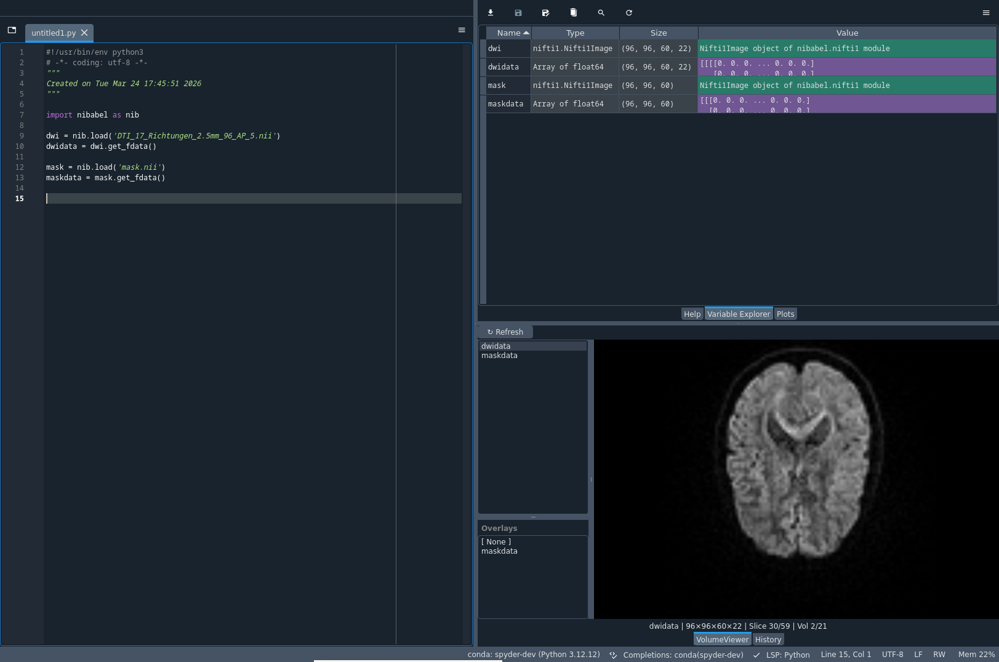
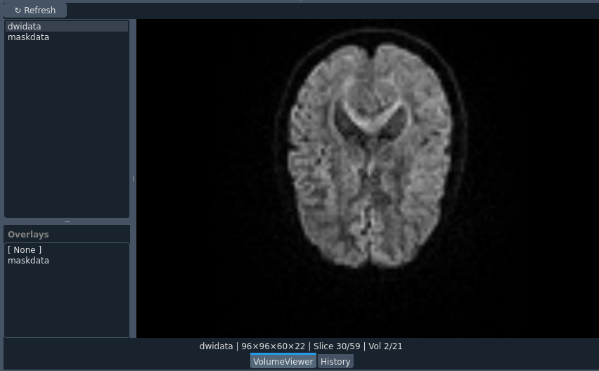
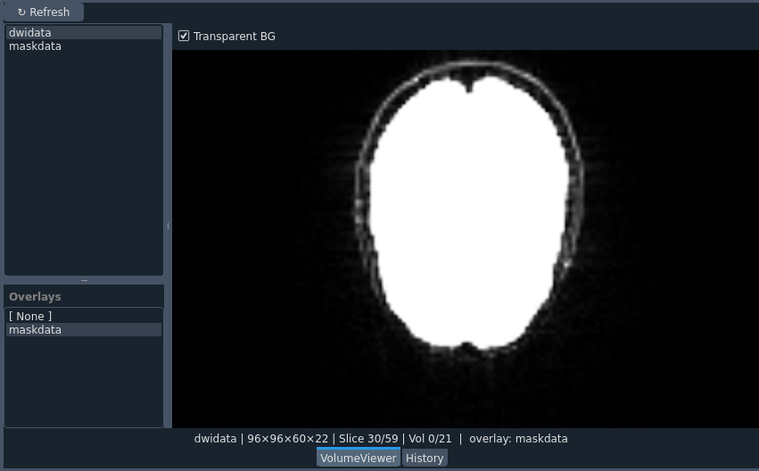

# spyder-volume-viewer
Spyder plugin for viewing 2D, 3D, and 4D numpy arrays during scripting. The goal is to eliminate the need to constantly use explicit plotting or saving a temporary files just to look at them in standalone viewers. 

While developed with MR images in mind, this plugin is fully suitable for any numpy array visualization to guide your scripting.

This is a **work in progress**. First stable release (version 1.0.0) is planned for April 2026.

### Limitations
- Development on Linux (Debian 12/13), untested on other OS
- Developed for Spyder installed via conda. Other python environment managers or Spyder installation approaches are untested.
- version <1.0.0 is for Spyder 5, most likely not working in Spyder 6

### Installation
1. either clone the repo or download the latest release
2. `cd` yourself into the downloaded folder
3. (optional but recommended) setup a specific virtual environment with Spyder 5
4. run `pip install .` from the base folder of the plugin

Stable release will be made available via pypi when ready.  

### Functionalities
- [x] view 2D [x], 3D [x], and 4D [x] numpy arrays which are currently loaded in the variable explorer
- [x] numpy arrays with the same dimensions as the main viewed image can be loaded as overlays
- [x] scrolling using mouse wheel through the z-axis
- [x] scrolling using UP and DOWN arrow keys through the z-axis
- [x] scrolling through the volumes (4th dim) using LEFT and RIGHT arrow keys
- [x] volume value ranges within loaded image shown at the bottom infobar
- [ ] On refresh, immediately update the overlay list so that base image does not have to be reloaded
- [ ] mouse wheel scrolling is very sensitive now, needs to be calibrated
- [ ] unload the viewed image (currently only overlay can be removed)
- [ ] possibility to change the axis of visualization so that separate permute within script is not required
- [x] slider for opacity of overlay
- [x] colormap selection for overlay
- [ ] colormap selection for base image
- [ ] crosshair with voxel value indicator
- [ ] implementation for Spyder 6

### Sneek peak
Volume viewer (dockable Spyder plugin). Allows to view and scroll through multi-dimensional numpy arrays during scripting.
  

Click refresh to see available numpy arrays in the sidebar. Then left click to load it in the viewer.

Upon loading, the overlay tab appears with matching potential overlays. Left click to load the overlay.
Option to toggle between transparent background voxels available.

Example data taken from: [The B.A.T.M.A.N. tutorial](https://osf.io/fkyht/overview)

