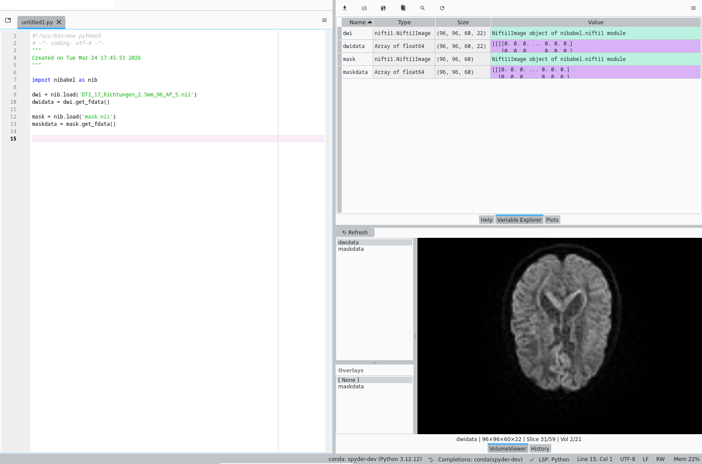

# spyder-volume-viewer
Spyder plugin for viewing 2D, 3D, and 4D numpy arrays during scripting. The goal is to eliminate the need to constantly save a temporary .nii just to look at it in standalone viewers. 

This is a **work in progress**. First stable release (version 1.0.0) is planned for April 2026.

### Limitations
- Development on Linux (Debian 12), untested on other OS
- v0.1.0 is for Spyder 5, most likely not working in Spyder 6

### Sneek peak

